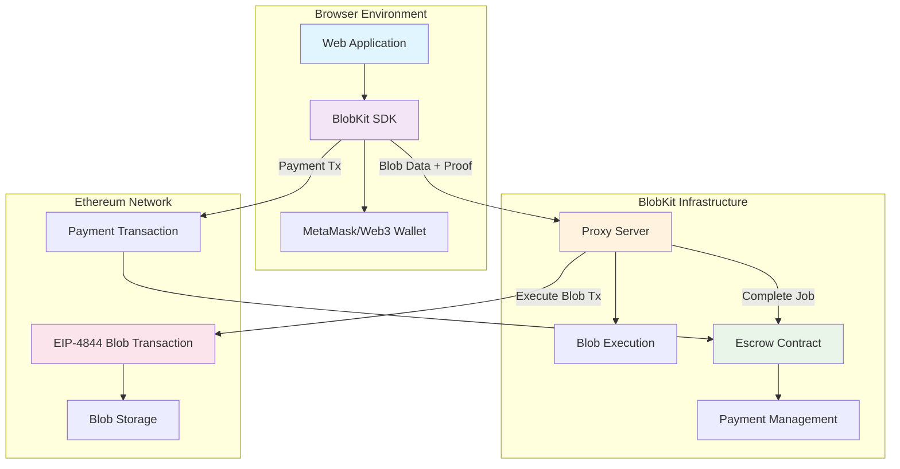

░▒▓███████▓▒░░▒▓█▓▒░      ░▒▓██████▓▒░░▒▓███████▓▒░░▒▓█▓▒░░▒▓█▓▒░▒▓█▓▒░▒▓████████▓▒░ 
░▒▓█▓▒░░▒▓█▓▒░▒▓█▓▒░     ░▒▓█▓▒░░▒▓█▓▒░▒▓█▓▒░░▒▓█▓▒░▒▓█▓▒░░▒▓█▓▒░▒▓█▓▒░  ░▒▓█▓▒░     
░▒▓█▓▒░░▒▓█▓▒░▒▓█▓▒░     ░▒▓█▓▒░░▒▓█▓▒░▒▓█▓▒░░▒▓█▓▒░▒▓█▓▒░░▒▓█▓▒░▒▓█▓▒░  ░▒▓█▓▒░     
░▒▓███████▓▒░░▒▓█▓▒░     ░▒▓█▓▒░░▒▓█▓▒░▒▓███████▓▒░░▒▓███████▓▒░░▒▓█▓▒░  ░▒▓█▓▒░     
░▒▓█▓▒░░▒▓█▓▒░▒▓█▓▒░     ░▒▓█▓▒░░▒▓█▓▒░▒▓█▓▒░░▒▓█▓▒░▒▓█▓▒░░▒▓█▓▒░▒▓█▓▒░  ░▒▓█▓▒░     
░▒▓█▓▒░░▒▓█▓▒░▒▓█▓▒░     ░▒▓█▓▒░░▒▓█▓▒░▒▓█▓▒░░▒▓█▓▒░▒▓█▓▒░░▒▓█▓▒░▒▓█▓▒░  ░▒▓█▓▒░     
░▒▓███████▓▒░░▒▓████████▓▒░▒▓██████▓▒░░▒▓███████▓▒░░▒▓█▓▒░░▒▓█▓▒░▒▓█▓▒░  ░▒▓█▓▒░     
                                                                                     

# BlobKit

**Blob storage solution for Ethereum EIP-4844**

[](https://www.npmjs.com/package/@blobkit/sdk)
[](https://github.com/blobkit/blobkit/actions)
[](https://opensource.org/licenses/MIT)
[](https://www.typescriptlang.org/)

BlobKit provides a TypeScript solution for storing data on Ethereum using EIP-4844 blob transactions. It includes a trust-minimized proxy system that enables browser wallets to store blobs without direct EIP-4844 support.

## About

Built by [**Zak Cole**](https://x.com/0xzak) ([@zscole](https://github.com/zscole)) at [**Number Group**](https://numbergroup.xyz) for the [**Ethereum Community Foundation**](https://ethcf.org).

**Package**: [blobkit on NPM](https://www.npmjs.com/package/blobkit)

**Contact**: For questions, support, or contributions, reach out to Zak at [zcole@linux.com](mailto:zcole@linux.com) or [@0xzak](https://x.com/0xzak) on X.

## Quick Start

### Installation

```bash
# SDK for blob storage
npm install @blobkit/sdk

# Proxy server for browser wallet support  
npm install @blobkit/proxy-server

# Smart contracts for escrow payments
npm install @blobkit/contracts
```

### Integration Demo

Run the complete BlobKit flow with the integration demo:

```bash
# Clone the repository
git clone https://github.com/blobkit/blobkit.git
cd blobkit

# Install dependencies and build packages
npm install
npm run build

# Start local development environment and run demo
npm run dev:setup
```

This demo:
1. Deploys the escrow contract locally
2. Starts a proxy server
3. Writes a blob using the SDK
4. Verifies end-to-end functionality

### Browser Usage

```typescript
import { BlobKit } from '@blobkit/sdk';

// Connect MetaMask
const signer = await window.ethereum.request({ method: 'eth_requestAccounts' });

// Create BlobKit instance
const blobkit = new BlobKit({
  rpcUrl: 'https://mainnet.infura.io/v3/YOUR-PROJECT-ID',
  chainId: 1,
  proxyUrl: 'https://proxy.blobkit.dev' // Handles EIP-4844 for browsers
}, signer);

// Store blob data
const result = await blobkit.writeBlob({
  message: 'Hello, decentralized storage!',
  timestamp: Date.now()
}, {
  appId: 'my-dapp',
  filename: 'message.json'
});

console.log(`Blob stored! Hash: ${result.blobHash}`);
```

### Node.js Usage

```typescript
import { BlobKit } from '@blobkit/sdk';
import { ethers } from 'ethers';

// Direct transaction (no proxy needed)
const provider = new ethers.JsonRpcProvider('https://mainnet.infura.io/v3/YOUR-PROJECT-ID');
const signer = new ethers.Wallet('YOUR-PRIVATE-KEY', provider);

const blobkit = new BlobKit({
  rpcUrl: 'https://mainnet.infura.io/v3/YOUR-PROJECT-ID',
  chainId: 1
}, signer);

const result = await blobkit.writeBlob(largeDataset);
```

## Packages

### [@blobkit/sdk](./packages/sdk/)
TypeScript SDK for blob storage
- Real KZG cryptography using `c-kzg` library
- Environment detection (Node.js, browser, serverless)
- MetaMask integration for browser wallets
- Payment flow management with escrow contracts
- Codec system for data encoding/decoding
- Cost estimation and gas optimization

### [@blobkit/proxy-server](./packages/proxy-server/)
Proxy service for browser environments
- Payment verification against escrow contracts
- OpenAPI 3.1 specification with Swagger UI
- Rate limiting and request validation
- Structured logging with Winston
- Docker deployment ready
- CLI interface for operations

### [@blobkit/contracts](./packages/contracts/)
Smart contracts for escrow system
- Escrow system with replay protection
- Proxy authorization and fee management
- Job timeouts and automatic refunds
- Emergency controls (pause/unpause)
- 100% test coverage with Foundry
- Complete NatSpec documentation

## Architecture



### Payment Flow

1. **Browser Environment**: Web applications use BlobKit SDK to interact with MetaMask
2. **Payment**: User pays into escrow contract via MetaMask transaction
3. **Blob Submission**: SDK sends blob data to proxy server with payment proof
4. **Verification**: Proxy server verifies payment exists in escrow contract
5. **Execution**: Proxy executes blob transaction using server-controlled private key
6. **Completion**: Proxy marks job complete in escrow and claims configured fee

### Trust Model

- **User Control**: Funds held in escrow until job completion or timeout
- **Automatic Refunds**: Failed or expired jobs refund automatically after timeout
- **Proxy Competition**: Multiple independent proxies prevent censorship
- **Verifiable Execution**: All operations recorded on-chain for transparency

## Features

### SDK Features
- Browser and Node.js compatibility
- Automatic environment detection
- MetaMask wallet integration
- Real KZG cryptographic operations
- Multiple data codec support
- Cost estimation before transactions
- Runtime environment validation
- Comprehensive error handling

### Proxy Server Features
- Express.js REST API
- Payment verification system
- Rate limiting and validation
- Health monitoring endpoints
- Structured JSON logging
- Docker containerization
- CLI management interface

### Smart Contract Features
- Trustless escrow payments
- Configurable job timeouts
- Automatic refund mechanisms
- Proxy authorization system
- Emergency pause functionality
- Replay attack protection

## Development

### Prerequisites

- Node.js 18 or higher
- npm 9 or higher for workspace support
- [Foundry](https://getfoundry.sh/) for smart contract development

### Setup

```bash
# Clone repository
git clone https://github.com/blobkit/blobkit.git
cd blobkit

# Install dependencies
npm install

# Build all packages
npm run build

# Run tests
npm test

# Start development environment
npm run dev:setup
```

### Package Scripts

```bash
# SDK development
npm run build --workspace=packages/sdk
npm test --workspace=packages/sdk

# Proxy server development  
npm run dev --workspace=packages/proxy-server
npm run build --workspace=packages/proxy-server

# Smart contract development
npm run test --workspace=packages/contracts
npm run deploy:local --workspace=packages/contracts
```

### Testing

```bash
# Run all tests
npm test

# Test individual packages
npm test --workspace=packages/sdk
npm test --workspace=packages/proxy-server
npm test --workspace=packages/contracts

# Integration testing
npm run demo
```

## Documentation

- [Getting Started](./docs/getting-started.md) - Installation and basic usage
- [SDK Documentation](./docs/sdk/) - Complete API reference
- [Proxy Server](./docs/proxy/) - Deployment and configuration
- [Smart Contracts](./docs/contracts/) - Contract integration guide
- [Architecture](./docs/architecture.md) - System design overview

## Security

BlobKit implements several security measures:

- **Escrow System**: User funds protected until job completion
- **Replay Protection**: Jobs can only be completed once
- **Input Validation**: All user inputs validated before processing
- **Rate Limiting**: Protection against spam and abuse
- **Emergency Controls**: Contract pause functionality for emergencies

**Note**: Smart contracts have not been professionally audited. Use in production at your own risk.

## Performance

- **Blob Size**: Supports up to 128KB per blob (EIP-4844 limit)
- **Transaction Cost**: Optimized for minimal gas usage
- **Throughput**: Scales with number of proxy servers deployed
- **Latency**: Sub-second response times for cost estimation

## Contributing

1. Fork the repository
2. Create a feature branch
3. Make your changes
4. Add tests for new functionality
5. Run the test suite
6. Submit a pull request

See [CONTRIBUTING.md](./CONTRIBUTING.md) for detailed guidelines.

## License

MIT License - see [LICENSE](./LICENSE) file for details.

## Support

- [GitHub Issues](https://github.com/blobkit/blobkit/issues) - Bug reports and feature requests
- [Documentation](./docs/) - Complete guides and API reference
- [Contact Zak Cole](mailto:zcole@linux.com) - Direct support and questions
