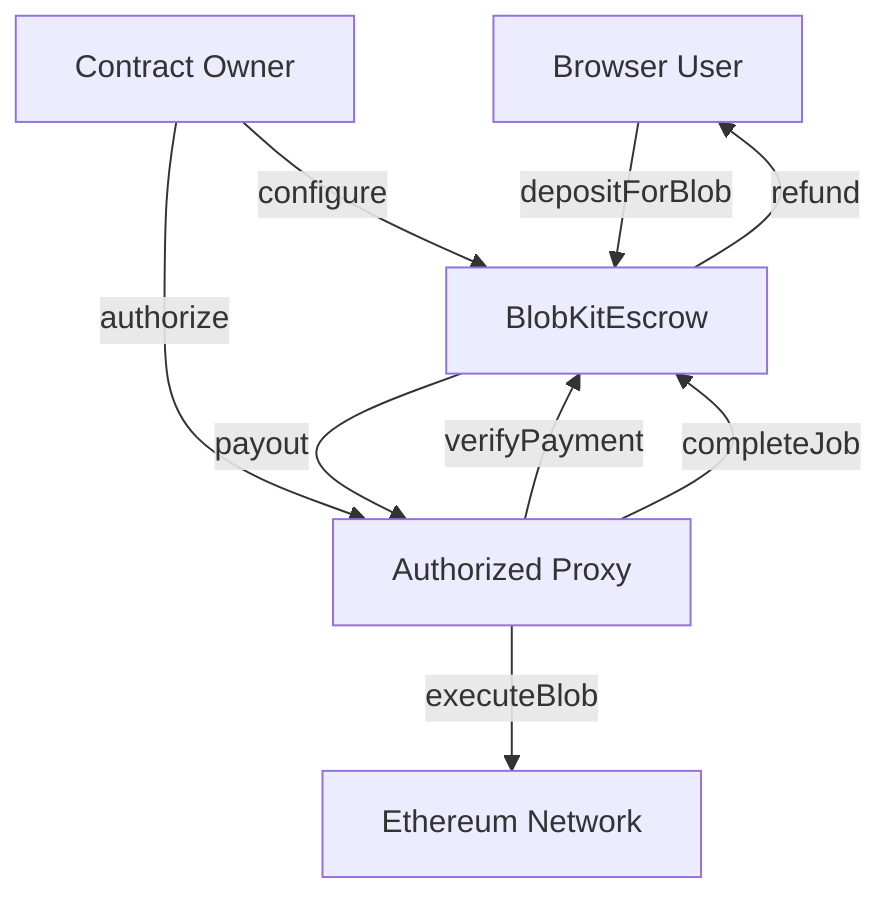

# BlobKit Contracts Documentation

Complete guide for deploying and integrating BlobKit smart contracts.

## Overview

The BlobKit contracts provide a trustless escrow system for blob storage payments with automatic refunds and proxy fee management.

## Architecture



## Installation

```bash
npm install @blobkit/contracts ethers
```

## Integration

### With Ethers.js

```typescript
import { ethers } from 'ethers';
import { BlobKitEscrowABI, getContractAddress } from '@blobkit/contracts';

const provider = new ethers.JsonRpcProvider('https://mainnet.infura.io/v3/YOUR_PROJECT_ID');
const signer = new ethers.Wallet('YOUR_PRIVATE_KEY', provider);

const escrowAddress = getContractAddress(1); // Mainnet
const escrow = new ethers.Contract(escrowAddress, BlobKitEscrowABI, signer);

// Deposit for a job
const jobId = ethers.keccak256(ethers.toUtf8Bytes('job-123'));
const tx = await escrow.depositForBlob(jobId, { value: ethers.parseEther('0.01') });
await tx.wait();

// Check job status
const job = await escrow.getJob(jobId);
console.log('Job completed:', job.completed);
```

## Contract Functions

### User Functions

- `depositForBlob(bytes32 jobId)` - Deposit payment for blob job
- `refundExpiredJob(bytes32 jobId)` - Claim refund for expired jobs

### Proxy Functions

- `completeJob(bytes32 jobId, bytes32 blobTxHash, bytes calldata proof)` - Complete job and claim payment
- `setProxyFee(uint256 percent)` - Set proxy fee (0-10%)

### Owner Functions

- `setProxyAuthorization(address proxy, bool authorized)` - Authorize/deauthorize proxies
- `setJobTimeout(uint256 timeout)` - Configure job timeout
- `pause()` / `unpause()` - Emergency controls

### View Functions

- `getJob(bytes32 jobId)` - Get job details
- `isJobExpired(bytes32 jobId)` - Check if job expired
- `getJobTimeout()` - Get current timeout

## Events

```solidity
event JobCreated(bytes32 indexed jobId, address indexed user, uint256 amount);
event JobCompleted(bytes32 indexed jobId, bytes32 blobTxHash, uint256 proxyFee);  
event JobRefunded(bytes32 indexed jobId, string reason);
event ProxyAuthorizationChanged(address indexed proxy, bool authorized);
```

## Development

Prerequisites:
- [Foundry](https://getfoundry.sh/)

```bash
forge build                # Build contracts
forge test                 # Run tests
forge test --coverage      # Run with coverage
forge fmt                  # Format code
```

## Deployment

### Local

```bash
# Start local node
anvil

# Deploy to local network
forge script script/Deploy.s.sol --rpc-url http://localhost:8545 --broadcast
```

### Testnet

```bash
export RPC_URL="https://sepolia.infura.io/v3/YOUR_PROJECT_ID"
export PRIVATE_KEY="your-private-key"

forge script script/Deploy.s.sol \
  --rpc-url $RPC_URL \
  --private-key $PRIVATE_KEY \
  --broadcast \
  --verify
```

### Mainnet

```bash
forge script script/Deploy.s.sol \
  --rpc-url $MAINNET_RPC_URL \
  --ledger \
  --broadcast \
  --verify
```

## Configuration

Set contract addresses via environment variables:

```bash
BLOBKIT_ESCROW_MAINNET=0x1234567890123456789012345678901234567890
BLOBKIT_ESCROW_SEPOLIA=0x1234567890123456789012345678901234567890
BLOBKIT_ESCROW_HOLESKY=0x1234567890123456789012345678901234567890
```

## Security

- Contracts use OpenZeppelin patterns (Ownable, ReentrancyGuard, Pausable)
- Custom errors for gas efficiency
- Replay protection for job completion
- Input validation on all functions
- Emergency pause functionality

**Note:** Contracts have not been professionally audited. Use at your own risk.

## Attribution

BlobKit was built by [Zak Cole](https://x.com/0xzak) at [Number Group](https://numbergroup.xyz) for the [Ethereum Community Foundation](https://ethcf.org). 