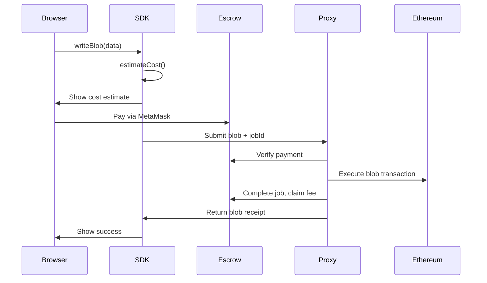

# Getting Started with BlobKit

BlobKit enables EIP-4844 blob storage on Ethereum through a production-ready SDK with automatic environment detection and trustless proxy support for browser wallets.

## Installation

```bash
npm install @blobkit/sdk ethers
```

## Browser Usage

```typescript
import { BlobKit } from '@blobkit/sdk';

// Connect MetaMask
const provider = new ethers.BrowserProvider(window.ethereum);
const signer = await provider.getSigner();

// Create BlobKit instance
const blobkit = new BlobKit({
  rpcUrl: 'https://mainnet.infura.io/v3/YOUR_PROJECT_ID',
  chainId: 1,
  proxyUrl: 'https://proxy.blobkit.dev'
}, signer);

// Store blob data
const result = await blobkit.writeBlob({
  message: 'Hello, decentralized storage!'
}, {
  appId: 'my-dapp',
  filename: 'greeting.json'
});

console.log('Blob hash:', result.blobHash);
console.log('Transaction:', result.blobTxHash);
```

## Node.js Usage

```typescript
import { BlobKit } from '@blobkit/sdk';
import { ethers } from 'ethers';

const provider = new ethers.JsonRpcProvider('https://mainnet.infura.io/v3/YOUR_PROJECT_ID');
const signer = new ethers.Wallet('YOUR_PRIVATE_KEY', provider);

const blobkit = new BlobKit({
  rpcUrl: 'https://mainnet.infura.io/v3/YOUR_PROJECT_ID',
  chainId: 1
}, signer);

const result = await blobkit.writeBlob(data);
console.log('Blob stored:', result.blobHash);
```

## Architecture

BlobKit solves browser wallet limitations through three components:

1. **[@blobkit/sdk](../packages/sdk/)** - TypeScript SDK for blob storage
2. **[@blobkit/proxy-server](../packages/proxy-server/)** - Proxy server for browser environments  
3. **[@blobkit/contracts](../packages/contracts/)** - Smart contracts for trustless payments

## Payment Flow



## Next Steps

- **[SDK Documentation](sdk/)** - Complete API reference
- **[Proxy Setup](proxy/)** - Deploy your own proxy server
- **[Contract Integration](contracts/)** - Smart contract details
- **[Architecture](architecture.md)** - System design overview

## Attribution

BlobKit was built by [Zak Cole](https://x.com/0xzak) at [Number Group](https://numbergroup.xyz) for the [Ethereum Community Foundation](https://ethcf.org). 