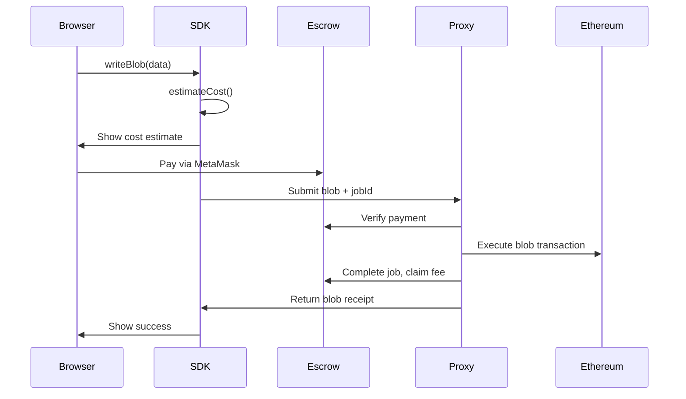

# Getting Started

BlobKit provides TypeScript tools for EIP-4844 blob storage on Ethereum, including browser support via proxy servers.

## Installation

```bash
npm install @blobkit/sdk ethers
```

## Browser Usage

```typescript
import { BlobKit } from '@blobkit/sdk';
import { ethers } from 'ethers';

const provider = new ethers.BrowserProvider(window.ethereum);
const signer = await provider.getSigner();

const blobkit = new BlobKit(
  {
    rpcUrl: process.env.BLOBKIT_RPC_URL!,
    chainId: 1,
    proxyUrl: 'https://proxy.example.com',
    requestSigningSecret: 'shared-secret-with-proxy'
  },
  signer
);

const result = await blobkit.writeBlob({ message: 'Hello world' }, { appId: 'my-app' });

console.log('Blob hash:', result.blobHash);
console.log('Transaction:', result.blobTxHash);
```

## Node.js Usage

```typescript
import { BlobKit } from '@blobkit/sdk';
import { ethers } from 'ethers';

const provider = new ethers.JsonRpcProvider(process.env.BLOBKIT_RPC_URL!);
const signer = new ethers.Wallet(process.env.PRIVATE_KEY, provider);

const blobkit = new BlobKit(
  {
    rpcUrl: process.env.BLOBKIT_RPC_URL!,
    chainId: 1
  },
  signer
);

const result = await blobkit.writeBlob(data);
console.log('Blob hash:', result.blobHash);
```

## Components

- **[@blobkit/sdk](../packages/sdk/)** - TypeScript SDK for blob storage
- **[@blobkit/proxy-server](../packages/proxy-server/)** - Proxy server for browser environments
- **[@blobkit/contracts](../packages/contracts/)** - Smart contracts for trustless payments

## Payment Flow



## Next Steps

- [SDK Documentation](sdk/)
- [Proxy Documentation](proxy/)
- [Contract Documentation](contracts/)
- [Architecture](architecture.md)
